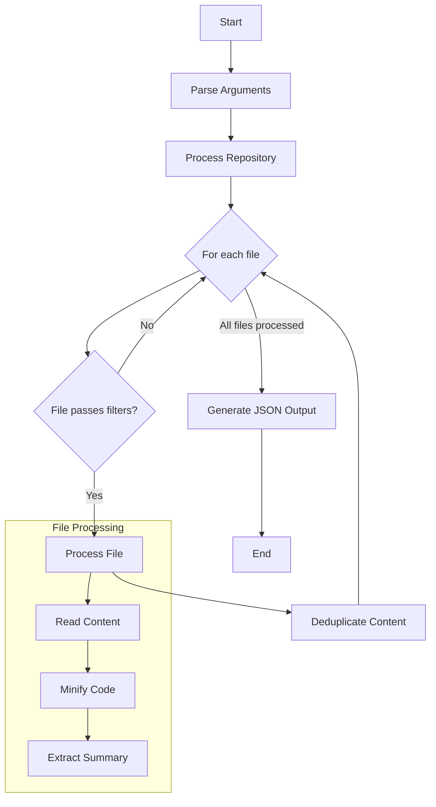

# repoUno: Repository Content Collector for LLMs

repoUno is a Python script that collects the contents of a Git repository into a single JSON file, optimized for analysis by language models. It includes features such as content deduplication, size limits, file filtering, and precautions against including sensitive information.

## Features

- Collects repository content into a single JSON file
- Content deduplication to avoid repetitive information
- Size limits for individual files and total content
- File filtering based on patterns and extensions
- Precautions to avoid including sensitive information
- Multi-threaded processing for improved performance

## Installation

1. Clone this repository:
   ```
   git clone https://github.com/yourusername/repouno.git
   ```
2. Navigate to the project directory:
   ```
   cd repouno
   ```
3. Ensure you have Python 3.6+ installed.

## Basic Usage

```
python repouno.py /path/to/repo [options]
```

### Options

- `-o, --output`: Output file path (default: repouno_content.json)
- `--ignore`: Ignore patterns (e.g., '*.pyc', '__pycache__')
- `--include`: Include patterns (e.g., '*.py', 'src/*')
- `--include-ext`: Include only these file extensions (e.g., '.py', '.md')
- `--exclude-ext`: Exclude these file extensions (e.g., '.log', '.tmp')
- `-m, --max-size`: Maximum individual file size in bytes to process (default: 5,000,000)
- `--max-total-size`: Maximum total size of content to process in bytes (default: 10,000,000)
- `-v, --verbose`: Enable verbose logging

## Advanced Usage Example

Here's an example of using repoUno with more advanced options:

```bash
python repouno.py /path/to/your/project \
  --output project_analysis.json \
  --ignore "*.log" "*.tmp" "node_modules/*" \
  --include "src/*" "tests/*" "*.md" \
  --include-ext ".py" ".js" ".ts" \
  --exclude-ext ".pyc" \
  --max-size 1000000 \
  --max-total-size 20000000 \
  --verbose
```

This command will:
- Analyze the project at `/path/to/your/project`
- Output the results to `project_analysis.json`
- Ignore all .log and .tmp files, and everything in the node_modules directory
- Only include files from the src and tests directories, and all markdown files
- Further filter to only include .py, .js, and .ts files
- Exclude all .pyc files
- Set a max file size of 1MB and a max total size of 20MB
- Enable verbose logging

## Workflow

Here's a simplified flowchart of how repoUno works:



This flowchart provides a high-level overview of the repoUno script's workflow.

## Using repoUno Output with an LLM

After running repoUno, you can use the generated JSON file as input for an LLM like Claude. Here's an example prompt you can use:

```
I have analyzed a software project using repoUno. The analysis is in the following JSON format:

{JSON_CONTENT}

Based on this analysis:
1. Provide an overview of the project structure and main components.
2. Identify the primary programming languages used.
3. Suggest potential areas for code improvement or optimization.
4. Are there any apparent security concerns or best practices that are not being followed?
5. Recommend next steps for enhancing the project's documentation or test coverage.

Please provide your analysis and recommendations.
```

Replace `{JSON_CONTENT}` with the actual content of the JSON file generated by repoUno.

This prompt will help the LLM understand the structure of your project and provide valuable insights and recommendations.

## License

[MIT License](LICENSE)

## Contributing

Contributions are welcome! Please feel free to submit a Pull Request.
